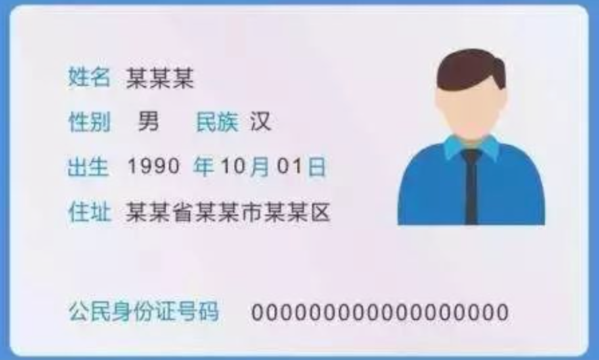
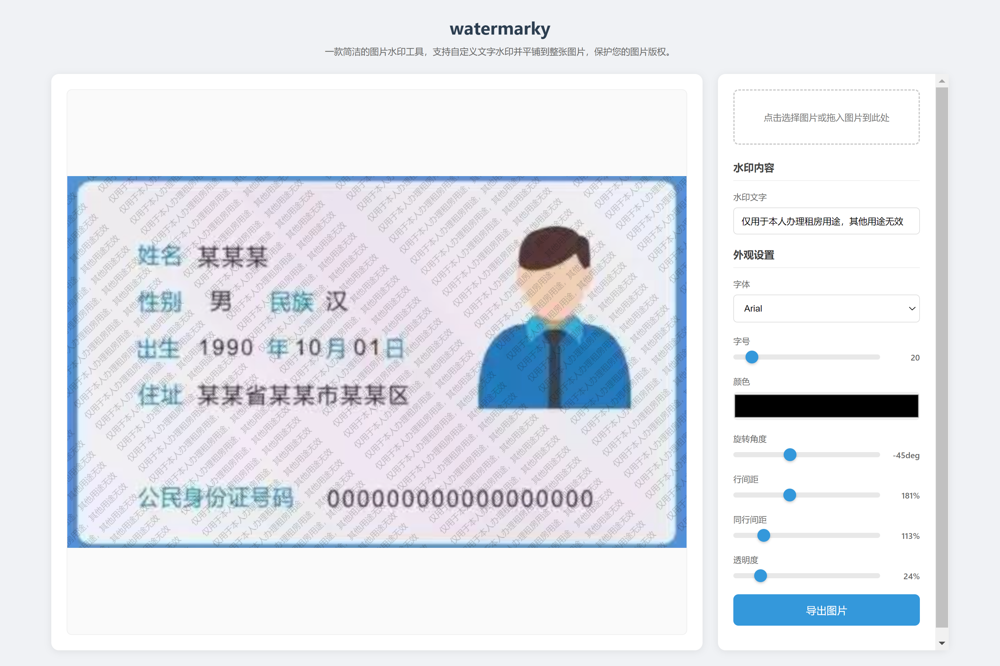

# watermarky
一款图片加水印工具，是一个单HTML文件的SPA（Single Page Application，单页应用），纯本地化操作，没有任何上传和网络操作，代码全部开源，可完全审查。

# 使用方法
在任何操作系统平台（Windows、Mac、Linux等）的任何浏览器（Chrome、Firefox等）打开`watermarky.html`，即可立即开始使用。

# 加水印效果

原图：

加水印：

导出的加了水印的图片：

# AI vibe coding prompt
开发一款SPA应用：watermarky，实现的功能：可以对图片加文字水印。
需求详细描述：
- 可以从本地文件选择图片文件，也可以把本地文件直接拖入浏览器中
- 可以在一个输入框中输入水印文字，水印文字可以填一个词，或一句话。默认水印文字：仅用于本人办理XX用途，其他用途无效
- 水印文字多行平铺到图片中
- 可调整水印文字的各项参数：字体、字号、颜色（默认黑色）、旋转角度（默认水印文字斜向左上方45度）、不同水印行之间的间距、同一行水印多句话之间的间距
- 数值类型的参数调整统一使用滑杆控件
- 可实时预览添加的水印的效果
- 可将添加了水印后的图片导出成新的图片文件
- 图片预览区域放置在页面的左侧，控制面板放在页面的右侧
